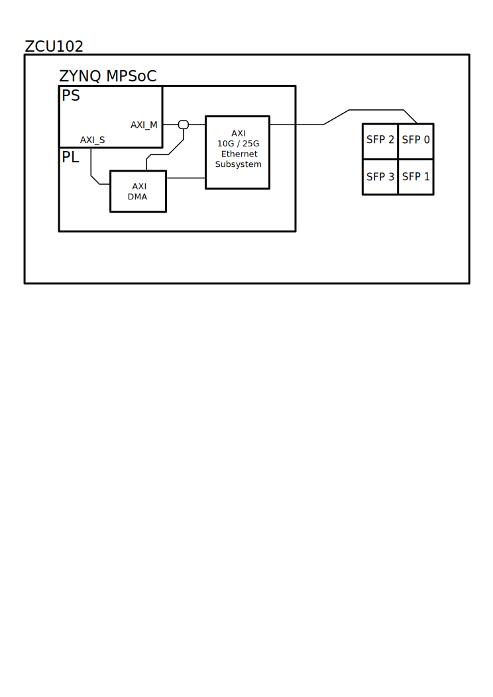

# PL Ethernet 10G
## DESCRIPTION:
This project utilizes AXI 10G/25G Ethernet Subsystem configured for 10GBASE-R. This has been routed to the SFP cage on SFP0 for use on a ZCU102 board. System is configured to use the ZCU102 si570 at 156.25MHz. NOTE: In its current state you will have to manually bring up the 10G interface using:

`ifconfig eth1 up`

eth0 is currently configured as GEM3 routed via RGMII to the on-board PHY.

## BLOCK DESIGN:

## USAGE:
Place all files into a new project directory.
#### VIVADO:
From the command line run the following:

`vivado -source *top.tcl`
    
#### PETALINUX:
From the command line run the following:

`petalinux-create -t project -s *.bsp`
